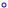
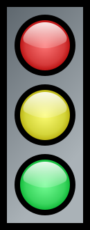
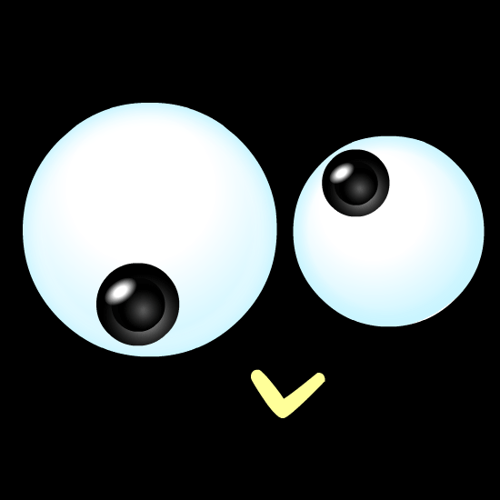

# GitHub README.md Image Support Tests

## Markdown

```html

```

renders as:


❌

---

```html

```

renders as:


❌

---

## SVG

```markdown

```

renders as:


✅

---

```markdown

```

renders as:


✅

---

```markdown

```

renders as:


✅❌ (the JavaScript animation is sanitized)

---

## URL

```html

```

renders as:


✅

---

```html

```

renders as:


✅

---

```html

```

renders as:


✅

---

```html

```

renders as:


✅

---

## Emoji / Unicode Emoticon

```markdown
😊
```

(:point_up: Unicode character)

renders as:

😊

---

```markdown
:blush:
```

(:point_up: GitHub Flavored Markdown `:EMOJINAME:`)

renders as:

:blush:

---

```markdown
<g-emoji class="g-emoji" alias="blush" fallback-src="https://github.githubassets.com/images/icons/emoji/unicode/1f60a.png">😊</g-emoji>
```

(:point_up: HTML in markdown)

renders as:

<g-emoji class="g-emoji" alias="blush" fallback-src="https://github.githubassets.com/images/icons/emoji/unicode/1f60a.png">😊</g-emoji>

---

(The three aforementioned all render as exactly the same thing)

## Image License

See [LICENSE.md](LICENSE.md)
